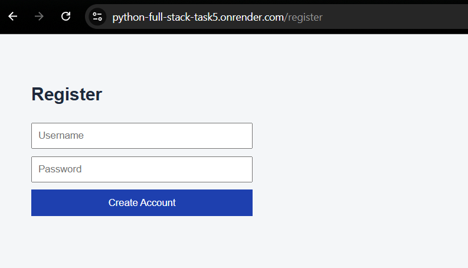
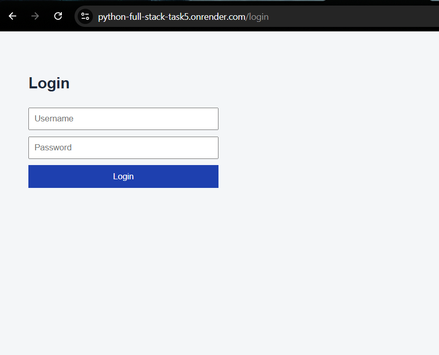
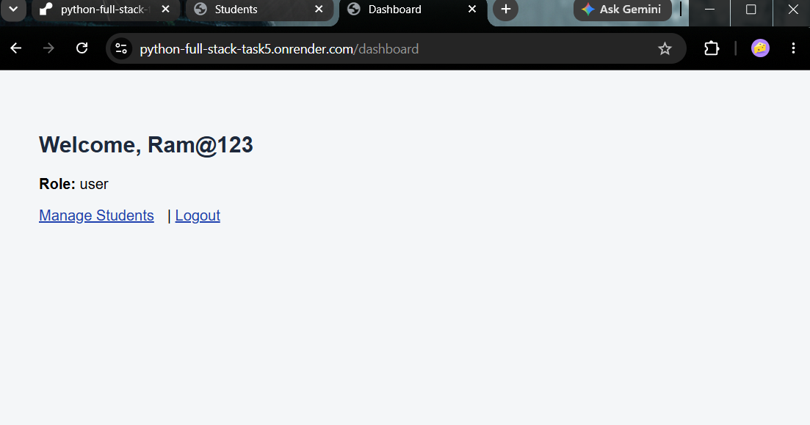
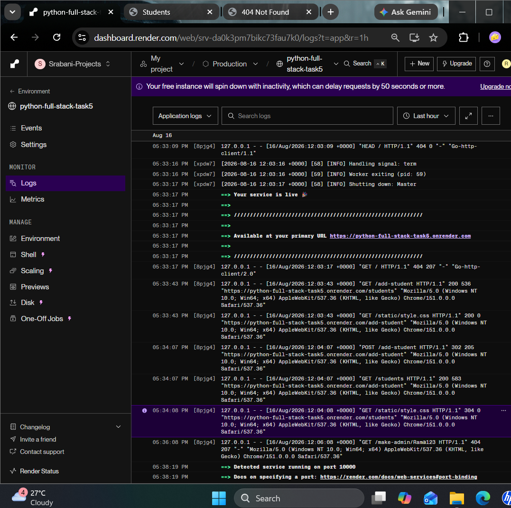

# Flask Deployment & Production Readiness
# 🚀 Task 5: Deployment, Environment Configuration, and Production Readiness of Flask Application

> Internship Task 5 @ Maincrafts Technology — Python Full Stack Development

---

## 1️⃣ Live Deployed URL

👉 **[https://python-full-stack-task5.onrender.com](https://python-full-stack-task5.onrender.com)**

> Note: Hosted on Render's free tier — the instance spins down after inactivity, so the first request after idle time may take 30–50 seconds to wake up.

---

## 2️⃣ GitHub Repository Link

👉 **[https://github.com/Srabani-mallick/python-full-stack-task5](https://github.com/Srabani-mallick/python-full-stack-task5)**

---

## 3️⃣ Screenshots

### Home / Register Page (Live URL)


### Login Page (Live URL)


### Dashboard Page (Live URL)


### deployement logs

---

## 4️⃣ Deployment Steps

1. **Prepared the app for production:**
   - Set `debug=False` in `app.py`
   - Moved the Flask secret key to an environment variable
   - Generated `requirements.txt`:
```bash
     pip freeze > requirements.txt
```
   - Added a `Procfile` with:
    web: gunicorn app:app

- Database tables (`users`, `students`) auto-create on startup via an `init_db()` function, so no manual database setup is needed on the server

2. **Pushed the project to GitHub:**
```bash
   git init
   git add .
   git commit -m "Flask app ready for deployment"
   git branch -M main
   git remote add origin https://github.com/Srabani-mallick/python-full-stack-task5.git
   git push -u origin main
```

3. **Created a Web Service on [Render](https://render.com):**
   - Connected the GitHub repository
   - Environment: Python 3
   - Build Command: `pip install -r requirements.txt`
   - Start Command: `gunicorn app:app`
   - Added Environment Variable: `SECRET_KEY`

4. **Render built and deployed the app automatically**, generating a live public URL.

5. **Verified** the live URL loads correctly and core features (register, login, dashboard, CRUD, REST APIs) work in production.

---

## 🔑 Environment Variables Used

| Variable      | Purpose                              | Where it's set                         |
|---------------|----------------------------------------|-------------------------------------------|
| `SECRET_KEY`  | Signs Flask session cookies securely    | Local `.env` file (dev) + Render dashboard (production) |

Read in code via:
```python
app.secret_key = os.environ.get("SECRET_KEY", "fallback-dev-key")
```

No secrets are hardcoded — the key is injected at runtime from the environment in both local and production settings.

---

## 🛠️ Tech Stack


---

## 📁 Project Structure
task5/
├── app.py # Main Flask application
├── database.db # SQLite database (auto-created on startup)
├── requirements.txt # Python dependencies for deployment
├── Procfile # Tells Render how to run the app (Gunicorn)
├── .env # Local environment variables (NOT pushed to GitHub)
├── static/
│ └── style.css # Stylesheet
├── templates/
│ ├── login.html
│ ├── register.html
│ ├── dashboard.html
│ ├── admin.html
│ ├── add_student.html
│ ├── students.html
│ └── edit_student.html
├── .gitignore
└── README.md
---

## 🚀 How to Run Locally

```bash
# 1. Clone the repo
git clone https://github.com/Srabani-mallick/python-full-stack-task5.git

# 2. Go into the folder
cd python-full-stack-task5

# 3. Create virtual environment
python -m venv venv
venv\Scripts\activate      # Windows

# 4. Install dependencies
pip install -r requirements.txt

# 5. Create a .env file with:
# SECRET_KEY=your-secret-key-here

# 6. Run the app
python app.py
```

Then open your browser and go to → `http://127.0.0.1:5000/register`

---

## 🎓 Key Learnings

- Difference between a local development server and a production WSGI server (Gunicorn)
- Securing secrets using environment variables instead of hardcoding
- Preparing a Flask app for deployment (`requirements.txt`, `Procfile`)
- Deploying an app to a cloud platform (Render) with a live public URL
- Debugging deployment-specific issues (e.g., case-sensitivity differences between Windows and Linux filesystems)
- Understanding limitations of SQLite on free-tier cloud hosting (non-persistent storage)

---

## 👩‍💻 Author

**Srabani Mallick**
B.Tech CSE | ITER, SOA University
Intern @ Maincrafts Technology